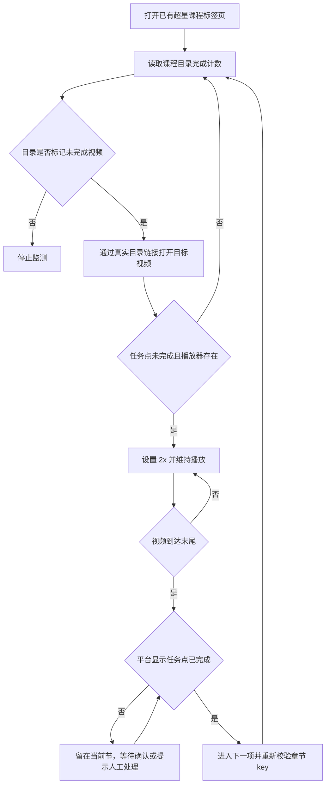

# 超星视频事件联播

> 面向超星学习平台的轻量 Chrome Manifest V3 扩展：在用户已经打开的课程页面中，自动维持未完成视频的 2 倍速播放，并在平台确认任务点完成后继续下一项。

<p>
  
  
  
</p>

## 项目简介

超星页面会把“视频播放结束”“任务点完成”和“下一节导航”作为不同的异步状态处理。简单监听 `ended` 并直接点击“下一节”，可能在平台尚未记账时跳过视频。

本项目的核心原则是：

> 只有平台明确确认当前任务点完成，才允许自动导航；目录中已完成的项目永远不重播。

## 功能特性

- 自动维持 `2x` 播放速度。
- 仅处理当前页面明确显示为未完成的任务点。
- 识别嵌套播放器和超星 SPA 页面内切换。
- 按章节 key 隔离事件，避免上一节的旧事件跳过当前节。
- 将“视频结束”与“任务点完成”分离判断。
- 平台确认完成后才执行“下一节”。
- 对播放器异步加载、首次自动播放失败提供有限次数恢复。
- 不使用权限 API，不上传课程数据，不修改平台记录。
- 支持通过 Codex 每分钟心跳作为保底监测；正常播放时保持静默。

## 工作原理



## 目录结构

```text
.
├── content.js                         # Chrome 内容脚本
├── manifest.json                      # Manifest V3 配置
├── README.md                          # 项目说明
└── skills/
    └── chaoxing-video-autoplay/
        └── SKILL.md                   # Codex 可复用操作规范
```

## 安装

1. 下载或克隆本项目。
2. 在 Chrome 地址栏打开 `chrome://extensions/`。
3. 开启右上角“开发者模式”。
4. 点击“加载未打包的扩展程序”，选择项目根目录。
5. 打开或刷新超星课程页面。

扩展只声明 `https://mooc1.chaoxing.com/*` 的内容脚本匹配规则，不需要额外权限。

## 使用方式

1. 先登录超星并打开课程章节页面。
2. 确认课程目录能看到任务点完成计数。
3. 让扩展处理明确标记为未完成的视频。
4. 检查播放器显示 `2x`，且当前时间持续增长。
5. 视频结束后等待平台把任务点更新为“已完成”，再观察是否进入下一项。

如果出现“继续当前节/跳到下一节”的提示：

- 当前任务点尚未显示完成：留在当前节，不要跳下一节。
- 当前任务点已显示完成：可以继续下一节。
- 出现作业、AI 场景题、考试、验证码、登录或安全提示：停止自动操作并人工处理。

## 关键改进记录

### 1. 不再用猜测的章节编号定位

章节 ID 可能因课程实例或平台状态变化而不同。扩展和操作流程应以课程目录中的实际链接为入口，避免直接拼接 `chapterId` 导致无权限页或误开章节。

### 2. `ended` 不再直接等同于完成

视频结束只说明媒体播放到末尾；平台可能还没完成任务点记账，或正在显示确认弹窗。当前版本会等待页面出现“任务点已完成”，否则停留在当前章节。

### 3. 防止 SPA 旧事件串节

超星会复用页面、播放器甚至 `<video>` 节点。每次安装监听器都绑定当前章节 key，旧章节的 `ended`、`pause` 和 `timeupdate` 事件无法完成新章节。

### 4. 已完成项目去重

扩展按章节 key 保存已确认完成的项目，并在页面显示完成状态时立即暂停已完成视频，防止联播过程中重复播放。

### 5. 取消“无视频自动跳过”

播放器可能异步加载。页面短时间没有发现 `<video>` 不代表它是阅读章节，因此不再仅因等待超时就点击“下一节”。

## 故障排查

### 视频没有自动开始

- 确认页面仍在 `mooc1.chaoxing.com`。
- 确认当前任务点显示为未完成。
- 刷新课程页面，并在扩展管理页重新加载未打包扩展。
- 检查播放器按钮是否为“暂停”；若显示“播放视频”，需要允许页面完成加载或人工点击一次播放。

### 视频结束后没有跳转

先查看页面是否已经显示“任务点已完成”。如果没有，继续留在当前节等待平台确认；如果一直不更新，不要手动连点“下一节”，应回到目录检查剩余计数。

### 出现无权限页

不要继续猜测章节 ID。返回课程门户，从目录实际链接重新打开目标项目；必要时重新登录超星。

## 隐私与使用边界

本扩展没有网络请求权限，不向第三方上传视频、课程或用户数据。它只在当前页面调整播放器状态、读取任务点文字并触发页面已有的导航行为。

本项目用于减少重复点击和漏播，不用于绕过验证码、作业、考试、AI 场景题、安全验证或平台学习记录。实际完成状态以超星页面显示为准。

## 开发与验证

```bash
node --check content.js
```

修改后，在 `chrome://extensions/` 中点击扩展的“重新加载”，再刷新课程页面验证。建议至少检查：

- 未完成视频能以 2 倍速播放；
- 已完成视频不会重播；
- 播放结束但任务点未确认时不会跳转；
- SPA 换节后旧事件不会跳过新章节；
- 目录计数达到全部完成后停止自动化。

## 版本

当前版本：`1.1.17`

该版本包含章节事件隔离、完成状态确认、有限重试和安全停留逻辑。
